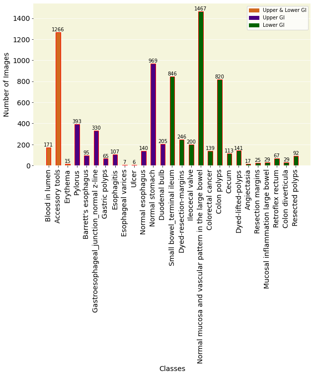

# GastroMalign
GastroMalign: Early Detection and Prognostic Modeling for High-Risk GastroIntestinal Lesions

---

## **Table of Contents**
1. [Abstract](#abstract)
2. [Key Objectives](#key-objectives)
3. [Dataset](#dataset)
4. [Methodology and Architecture](#methodology-and-architecture)
5. [Work Flow](#workflow-diagram)
6. [Classification and Follow-Up Recommendations](#classification-and-follow-up-recommendations)
7. [Results and Model Performance](#results-and-model-performance)
8. [Innovative Features](#innovative-features)
9. [Clinical Implications](#clinical-implications)
10. [Impact and Future Vision](#impact-and-future-vision)
11. [License](#license)

---

## **Abstract**
Accurate and early detection of gastrointestinal (GI) lesions is critical for improving patient outcomes, particularly in conditions with significant malignant potential. This study introduces GastroMalign, a novel framework leveraging Vision Transformer (ViT)-based models to classify GI lesions into four risk categories: Benign, Low-Risk, High-Risk, and Malignant. By employing advanced deep learning techniques, GastroMalign provides precise lesion classification, risk scoring, and visual risk mapping to aid in early cancer detection, prioritize high-risk cases, and support clinicians in decision-making for surveillance and treatment. This tool empowers clinicians with actionable insights for precise risk stratification, personalized follow-up planning, and improved patient outcomes through better management of high-risk and pre-cancerous lesions.

---

## **Key Objectives**
- This project aims to:
1. **Classify GI Lesions into Risk Categories**:
   - Classify lesions into Benign, Low-Risk, High-Risk, and Malignant categories based on their clinical progression and characteristics..
2. **Provide Malignancy Potential Scoring**:
   - Develop a proprietary scoring system for assessing the likelihood of malignant transformation using features such as lesion size, irregular borders, vascularization, and cellular atypia..
3. **Predict Time-to-Progression**:
   - Estimate the timeline for high-risk lesions to progress into malignant states, providing clinicians with data-driven follow-up recommendations
4. **Visual Risk Mapping**:
   - Generate heatmaps using Score-CAM to visually highlight high-risk regions within endoscopic images for precise targeting during monitoring or biopsy..
5. **Enhance Clinical Decision-Making**:
   - Combine lesion classification with historical progression timelines to optimize resource allocation and intervention planning.
6. **Demonstrate Superior Model Performance:**
   - Benchmark multiple models, including CNNs and Vision Transformers, to achieve the best classification performance for GI lesions.

---

## **Dataset**
**GastroVision Dataset**  
- **Source:** Multi-center open-access dataset from Baerum Hospital (Norway) and Karolinska University (Sweden).
- **Total Images:** 8,000 endoscopic images.
- **Classes:** 27 GI conditions.
- **Annotation:** Verified and annotated by experienced GI endoscopists.
- **Dataset Link:** [GastroVision Dataset](https://osf.io/84e7f/)

### Dataset Representation

### Visual Representation of Class Distribution

---

## **Methodology and Architecture**
### 1. **Hierarchical Convolutional Neural Network (CNN) with Attention**
   - **Hierarchical Analysis:** Identifies general abnormalities and granular malignant features.
   - **Attention Mechanism:** Focuses on details like cellular irregularities or vascular patterns.

### 2. **Vision Transformer (ViT)**
   - Treats image patches as tokens and applies attention mechanisms to global dependencies.
   - Outperforms CNNs in fine-grained classification after dataset-specific fine-tuning.
---
## Workflow Diagram

---

## **Classification and Follow-Up Recommendations**
This study introduces an innovative framework for the classification of gastrointestinal (GI) lesions into four categories: Benign, Low-Risk, High-Risk, and Malignant.

| **Category** | **Follow-Up Interval** | **Intervention Needed** | **Notes**                            |
|--------------|-------------------------|--------------------------|---------------------------------------|
| **Benign**   | 3–5 years              | No                      | Minimal monitoring                    |
| **Low-Risk** | 2–3 years              | No                      | Periodic surveillance                 |
| **High-Risk**| 6–12 months            | Yes                     | Timely follow-up and intervention     |
| **Malignant**| Immediate              | Yes                     | Urgent treatment                      |

### Lesion Classification Diagram

---

## **Results and Model Performance**

### Classification Accuracy (By Model):
| **Model**                | **Test Accuracy** | 
|--------------------------|-------------------|
| Pretrained ResNet-50     | 32.42%           | 
| Pretrained DenseNet-121  | 36.77%           | 
| CNN                      | 56%              | 
| ConvNeXt                 | 34.41%           |
| Swin Transformer         | 60.56%           | 
| **Vision Transformer (ViT)** | **80.06%**     | 

### ViT Model Metrics:
- **Test Accuracy:** 80.06%
- **Precision:** 79.65%
- **Recall:** 80.06%
- **F1 Score:** 79.17%
- **AUC (Micro-average):** 0.98
- **Class-Specific AUCs:** Ranging from 0.80 to 1.00

---

## **Innovative Features**
1. **Lesion Classification and Malignancy Potential Scoring**:
   - Classifies lesions and assigns malignancy scores based on clinical features.
   - Assigns a proprietary malignancy potential score based on lesion features (e.g., size, vascularization).
2. **Predictive Time-to-Progression Estimation**:
   - Estimates time-to-progression for high-risk lesions using historical data, aiding timely follow-ups.
   - Highlights rapid progression probabilities for urgent cases.

3. **Visual Risk Mapping**:
   - **Heatmaps:** Score-CAM generates overlays to highlight high-risk regions on endoscopic images.
- **Tracking:** Monitors changes over time in lesion size, borders, or vascularity.

---

## **Clinical Implications**
1. **Enhanced Decision-Making**:
   - High precision and recall ensure accurate lesion classification and timely interventions.
2. **Heatmaps for Precision Monitoring**:
   - Visual aids for improving biopsy targeting and reducing diagnostic errors.
3. **Prognostic Insights**:
   - Time-to-progression predictions help clinicians prioritize high-risk cases.

---

## **Impact and Future Vision**
1. **Early Detection and Prevention of GI Cancers**:
   - Proactive detection of high-risk lesions to prevent cancer progression.
   - Optimized resource allocation to prioritize critical cases.
2. **Real-World Data for Cancer Research and Training**:
   - Build a lesion progression database for cancer pathway research.
   - Create educational tools for medical training using predictions and heatmaps.

---

## **License**
  
This dataset in this project is licensed under the [Creative Commons Attribution 4.0 International License](https://creativecommons.org/licenses/by/4.0/).
